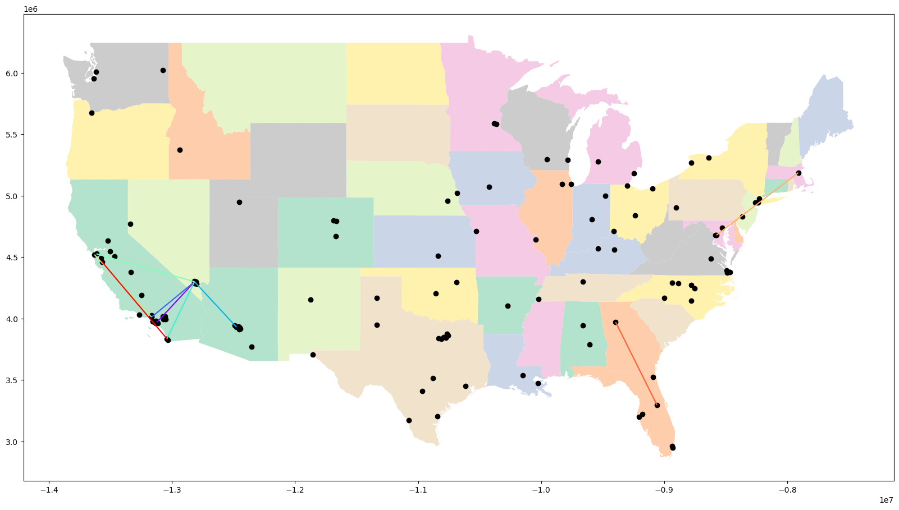
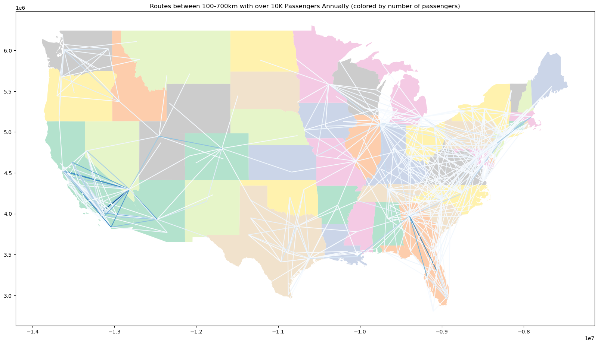

# Identifying Priority HSR Routes

An exploratory AI search problem designed to find an optimal High-Speed Rail (HSR) network for the US. This is a final project for Northeastern's CS4100 - Artificial Intelligence.

This project links census population data with city airport codes to analyze population served by flight routes and identify high-traffic and high-emissions corridors, then visualizes input flight data, census data, and outputted solutions using GeoPandas and Matplotlib.

## Description of the Search Problem

This project explores solutions to two search problems, numbered Problem 1 and Problem 2:

### Problem 1

Given a fixed construction budget, what is the optimal selection of intercity rail corridors to build?

- The cost of building a certain rail segment is the negative of the "benefit" gained from the segment, as defined by the metrics we are interested in.
- The goal state is any state in which the total monetary costs of constructing all present rail segments is equal to the predetermined budget.

### Problem 2

Given a goal of improving national metrics (emissions, population served by rail, etc.)
by a specified amount, what is the least-cost investment necessary to achieve this,
and which arrangement of intercity rail corridors would satisfy this?

- The cost of building a certain rail segment is the construction cost.
- The goal state is any state in which the total benefit gained by all rail segments is at least the predetermined threshold.

## To run:

Navigate to the project root and execute: `python search/hsr.py`

## To generate the data needed for hsr.py:

1. Execute `python preprocessing/generate_intercity_passenger_vol.py`
1. Run the notebook `preprocessing/generate_algo_testing_date.ipynb`

## To visualize the outputted solution:

Run the notebook `search/explore-solution.ipynb`

## Authors

Jonah Stadtmauer, Vinit Patel
